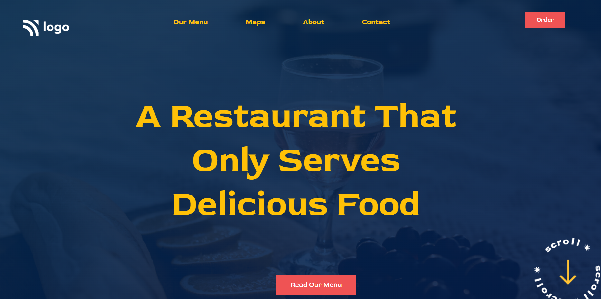

# Pratiksha Taank

***
## Technogy Used
- HTML
- CSS
## Screenshot

## What I have learn in this project
- Learned about leaner gradience
- Learned about all the background property
## Honest Time Spent
I spent 2 hours to complete this project
## Live Link
You can preview the project [Here](https://resta-urant.netlify.app/)
